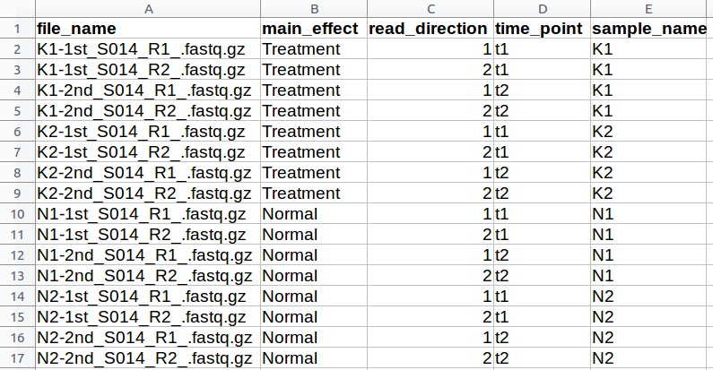
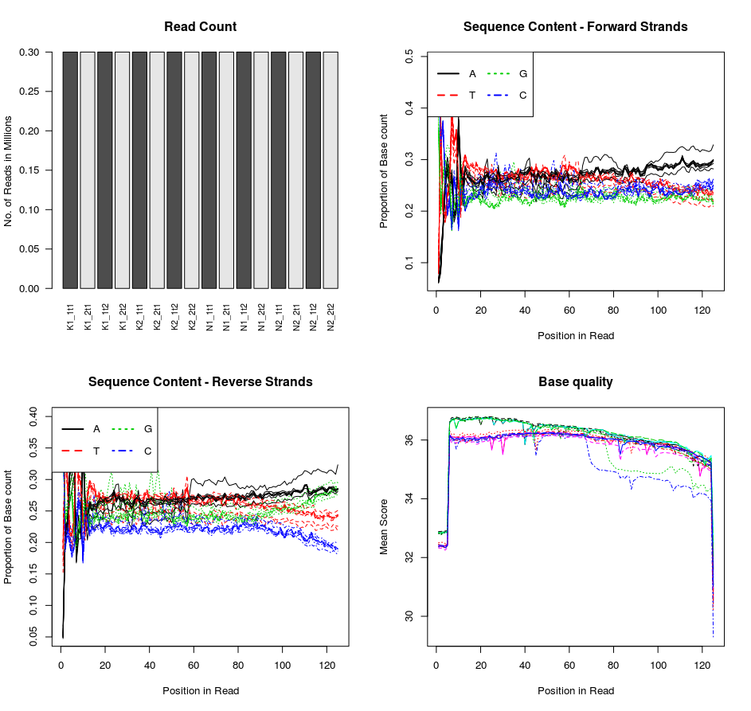
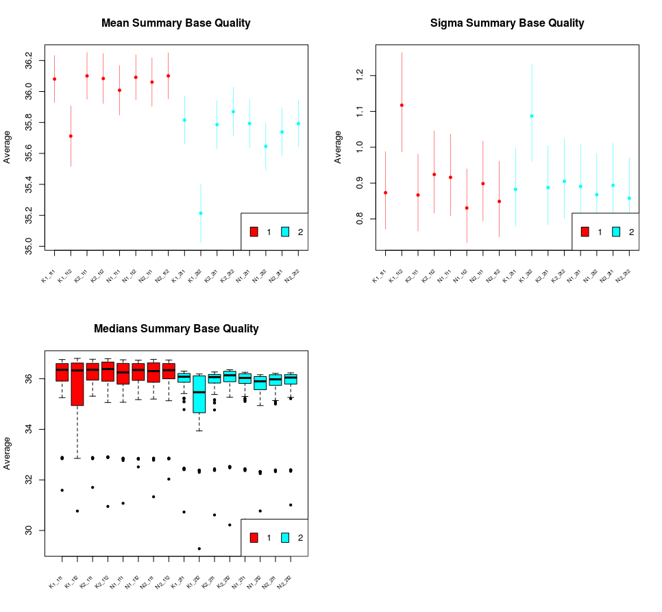
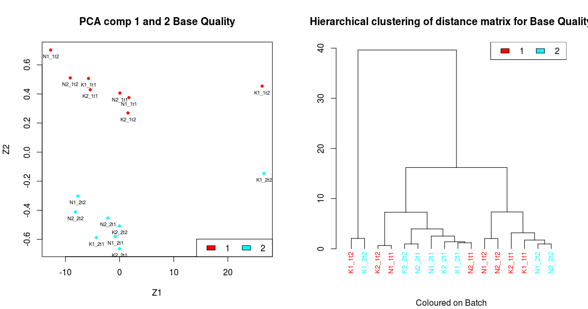
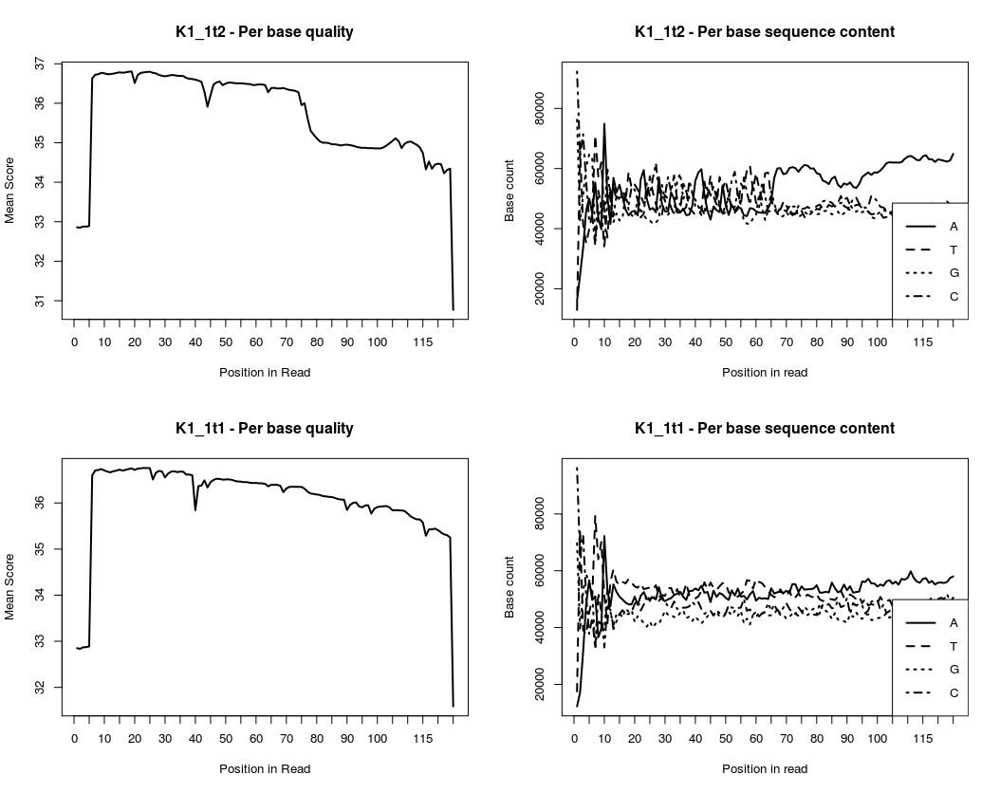

This tutorial has the following objectives  
+ Learn to clone (download) the code and associated test data.  
+ Install the necessary R and Bioconductor libraries.  
+ Perform the analysis of a batch of FASTQ files.  
+ Produce some relevant plots as part of exploratory data analysis (EDA).  
  
  
Cloning a repository (a collection of source code and data) from github using [RStudio](https://www.rstudio.com/products/rstudio/download/) couldn't be simpler. See the tutorial from RStudio, and scroll down to the section [Creating a new project based on a remote Git or Subversion repository](https://support.rstudio.com/hc/en-us/articles/200532077-Version-Control-with-Git-and-SVN). Copy and paste the url for the current git repository *https://github.com/uhkniazi/CFastqQuality*, into RStudio after creating a new version control project.  
  
  
The R and Bioconductor libraries used in this tutorial include:  
1. methods (may be installed by default)  
2. ShortRead (see bioconductor instructions on how to [install](http://bioconductor.org/packages/release/bioc/html/ShortRead.html))  
3. annotate ([Bioconductor instructions](https://www.bioconductor.org/packages/release/bioc/html/annotate.html))  
4. LearnBayes  
5. car  
6. dendextend  

The data are a selection of sub-samples from fastq files from the following [source](https://www.ncbi.nlm.nih.gov/pubmed/29870686). The directory sampleData in your project directory will contain a csv file.  

  
**Figure 1** shows the fastq files and associated metadata, including read direction. Each sample has two associated files from forward (1) and reverse (2) direction.  
  
  
The metadata shows that the samples are composed subjects divided into two groups (treatment and normal). Furthermore, each subject is measured at two time points (t1 and t2). The fastq files are paired end reads and each sample has two files (forward and reverse - 1 and 2). In total we have only 4 unique samples (K1, K2, N1 and N2). The structure in this data will need to be considered and controlled for at the data modelling level.  
  
To start the QC analysis and produce plots open the file tutorial.R. This file has two parts: one shows a small example of using the ShortRead library from bioconductor directly to produce an html report. This a quick and simple way to produce a report for a batch of fastq files, without any added analytical flexibility (see the ShortRead tutorial for more details).  
  
```R
## a small section from the short read tutorial to
## produce an html report for a set of fastq files
cvFiles = dir(path = 'sampleData/', pattern = "*fastq.gz", full=TRUE)

oQA = QACollate(QAFastqSource(cvFiles), QAReadQuality(),
                  QAAdapterContamination(), QANucleotideUse(),
                  QAQualityUse(), QASequenceUse(),
                  QAFrequentSequence(n=10), QANucleotideByCycle(),
                  QAQualityByCycle())
oQArep = qa2(oQA,  verbose=TRUE)

dir.create('temp')
rep = report(oQArep, dest = 'temp')
if (interactive())
  browseURL(res)
```
  
  
Next we use the functionality from the classes CFastqQuality and CFastqQualityBatch classes included in CFastqQuality.R. Start by loading the csv file for the metadata and look at the structure of the metadata file.  
```R
dfMetaData = read.csv('sampleData/metaData.csv', header=T)
dfMetaData$read_direction = factor(dfMetaData$read_direction)
str(dfMetaData)
'data.frame':	16 obs. of  5 variables:
  $ file_name     : Factor w/ 16 levels "K1-1st_S014_R1_.fastq.gz",..: 1 2 3 4 5 6 7 8 9 10 ...
$ main_effect   : Factor w/ 2 levels "Normal","Treatment": 2 2 2 2 2 2 2 2 1 1 ...
$ read_direction: Factor w/ 2 levels "1","2": 1 2 1 2 1 2 1 2 1 2 ...
$ time_point    : Factor w/ 2 levels "t1","t2": 1 1 2 2 1 1 2 2 1 1 ...
$ sample_name   : Factor w/ 4 levels "K1","K2","N1",..: 1 1 1 1 2 2 2 2 3 3 ...
```
You can create a similar csv file for your own data set and add the relevant factors as columns.  

To analyse a batch of fastq files the object of the class CFastqQualityBatch requires some information, so we create these input variables:  
```R
# set input variables required for analysis
fReadDirection = factor(dfMetaData$read_direction)
# unique names for each file
cNames = paste0(as.character(dfMetaData$sample_name), '_', as.character(dfMetaData$read_direction), as.character(dfMetaData$time_point))
# any additional factors that need including in the metadata list
lMetaData = list(meta=dfMetaData)
> cNames
 [1] "K1_1t1" "K1_2t1" "K1_1t2" "K1_2t2" "K2_1t1" "K2_2t1" "K2_1t2" "K2_2t2" "N1_1t1" "N1_2t1" "N1_1t2" "N1_2t2"
[13] "N2_1t1" "N2_2t1" "N2_1t2" "N2_2t2"
```
Next we create the object to perform the anaysis on the fastq files.  
```R
## create object, takes less than a minute on my machine
> ob = CFastqQualityBatch(paths, cNames, fReadDirection, lMetaData)
reading K1_1t1 ... done K1_1t1 
reading K1_2t1 ... done K1_2t1 
reading K1_1t2 ... done K1_1t2 
reading K1_2t2 ... done K1_2t2 
reading K2_1t1 ... done K2_1t1 
reading K2_2t1 ... done K2_2t1 
reading K2_1t2 ... done K2_1t2 
reading K2_2t2 ... done K2_2t2 
reading N1_1t1 ... done N1_1t1 
reading N1_2t1 ... done N1_2t1 
reading N1_1t2 ... done N1_1t2 
reading N1_2t2 ... done N1_2t2 
reading N2_1t1 ... done N2_1t1 
reading N2_2t1 ... done N2_2t1 
reading N2_1t2 ... done N2_1t2 
reading N2_2t2 ... done N2_2t2 
```
The next few lines will show the basic functionality of the class in order to extract various statistics and produce plots of interest.  
**NOTE** this class was written and tested in linux environment, so some functionality requiring counting number of reads in files if your system does not understand bash commands may not work. You may work around that by producing non-compressed fastq files.  
```R
## get read counts in millions
> iGetReadCount(ob)
K1_1t1 K1_2t1 K1_1t2 K1_2t2 K2_1t1 K2_2t1 K2_1t2 K2_2t2 N1_1t1 N1_2t1 N1_1t2 N1_2t2 N2_1t1 N2_2t1 N2_1t2 N2_2t2 
   0.3    0.3    0.3    0.3    0.3    0.3    0.3    0.3    0.3    0.3    0.3    0.3    0.3    0.3    0.3    0.3 
## produce some relevant plots
> barplot.readcount(ob)
> plot.alphabetcycle(ob)
> plot.qualitycycle(ob)
``` 
The next few figures will show the plots of interest for the batch of fastq files.  
  
**Figure 2** shows the quality statistics for the fastq files. There are a couple of samples that appear not to follow the trend of the rest of the batch of fastq files.  
  
Now we will perform some additional analysis to look for outlier samples based on the Base Quality metrics extracted from the quality object. Before doing this analysis, we will download and source the code for the class CDiagnosticsPlots.  
```R
library(downloader)
url = 'https://raw.githubusercontent.com/uhkniazi/CDiagnosticPlots/master/CDiagnosticPlots.R'
download(url, 'CDiagnosticPlots.R')

# load the required packages
source('CDiagnosticPlots.R')
# delete the file after source
unlink('CDiagnosticPlots.R')
```
CDiagnosticPlots is a class to produce summary statistic plots for a data matrix. The object accepts a data matrix with samples in columns (subject space) and variables in rows (variable space) and a title for the plots.

```R
## extract the base quality matrix 
> mBatch = mGetReadQualityByCycle(ob)
## 125 rows i.e. read length, and 16 fastq files
> dim(mBatch)
[1] 125  16
## each cell in the matrix represents the average base quality at a position 
## in the reads from a fastq file
> mBatch[1:10, 1:4]
        K1_1t1   K1_2t1   K1_1t2   K1_2t2
 [1,] 32.85105 32.45320 32.85926 32.36149
 [2,] 32.83628 32.40745 32.85023 32.36111
 [3,] 32.86914 32.43164 32.87815 32.38296
 [4,] 32.87338 32.40958 32.87658 32.29966
 [5,] 32.88934 32.46707 32.89155 32.38716
 [6,] 36.59681 36.19028 36.62935 36.09369
 [7,] 36.70562 36.10528 36.72369 35.94658
 [8,] 36.71339 36.10211 36.73234 36.01004
 [9,] 36.73466 36.09763 36.77224 35.69000
[10,] 36.70517 36.10603 36.75682 35.90664
```
  
After creating the object we perform slight house keeping, as the diagnostics object automatically adds a slight jitter to the original data to remove zeros, in order to avoid division by zero. This however is not the case in our data matrix which is not full of zeros.
```R
## creat an object of diagnostics class to make plots
oDiag = CDiagnosticPlots(mBatch, 'Base Quality')

## turning off automatic jitters
## we set jitter to FALSE for PCA, otherwise, in sparse matrix a random jitter is added to avoid divisions by zeros
l = CDiagnosticPlotsGetParameters(oDiag)
l$PCA.jitter = F; l$HC.jitter = F;
oDiag = CDiagnosticPlotsSetParameters(oDiag, l)
```
Next we plot various low dimensional summaries of the quality matrix to help us identify outlier samples.  
  
**Figure 3** shows the single point summaries for each sample based on the base quality. We have three types of summary statistics with the mean and 95% high density interval (standard error) for the respective statistic. The factor used for colouring the plots is the forward and reverse read identifier, but this can be any factor of choice and is useful for identifying batch effects, if systematic differences between grouping variables can be seen. **Top Left:** the mean and error for the average quality in each sample. The general trend from the colours suggests that forward reads have a slightly higher quality than reverse reads (which is normal). There are two samples in each group that are lower than their groups, K1_1t2 and K1_2t2 - fastq files from the subject K1 and time point 2. **Top Right:** mean and error for the variance of the data quality in each sample. The overall variance between the forward and reverse groups is comparable, but the same 2 samples have higher variances. **Bottom Left:** Box plots showing the median and spread in each sample. The same two samples show different behaviour to the rest of their red and blue groups.  
  
Why do we see this trend, its perhaps because these two samples have a dip in the quality towards the 3 prime end of the read; this can be seen in the plots in Figure 2.  
  
  
**Figure 5** shows the first two components of the PCA plots and a Hierarchical clustering plot based on the sample distance matrix. Both plots identify these two samples as being different from the rest of the data.  
  
We compare the sample from individual K1 and time point 1 with K1 at time point 2 to show that indeed there is a problem with this fastq file. 
```R
## plot the quality for these 
plot.qualitycycle(ob@lData$K1_1t2)
plot.alphabetcycle(ob@lData$K1_1t2)
## compare this with a time point 1 sample
plot.qualitycycle(ob@lData$K1_1t1)
plot.alphabetcycle(ob@lData$K1_1t1)
``` 

  
**Figure 6** The figures in the top row are from the flagged sample, while the bottom row shows a different sample. It appears that there are many As at the 3' end of the sample with low quality base calls.  
  
